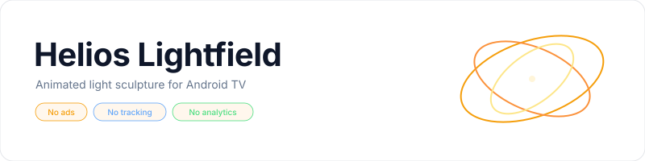
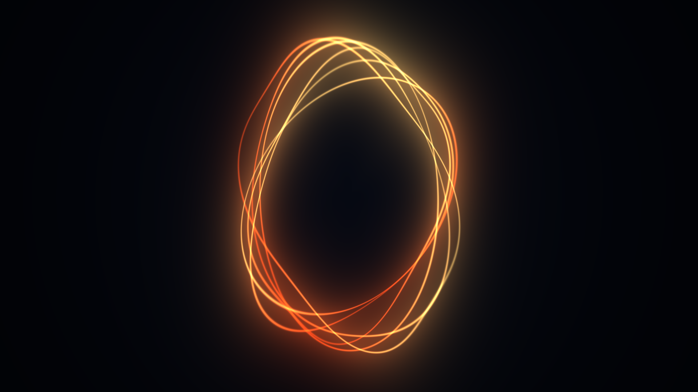
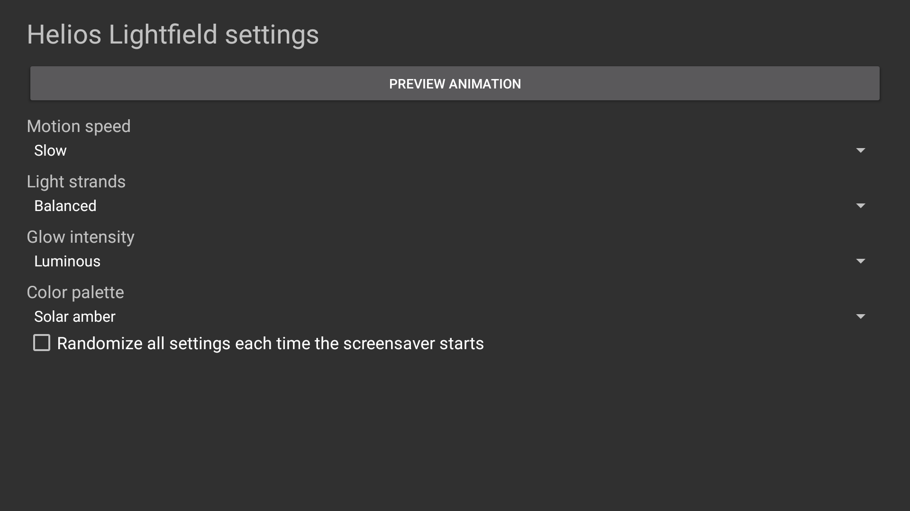

<p align="center">
    <picture>
        <source media="(prefers-color-scheme: dark)" srcset="art/banner-dark.svg">
        <source media="(prefers-color-scheme: light)" srcset="art/banner-light.svg">
        
    </picture>
</p>

<p align="center">A continuously animated field of luminous, orbiting light strands for Fire TV, Android TV, and Google TV.</p>

<p align="center">
    <a href="https://github.com/jeremykenedy/helios-lightfield/releases"></a>
    <a href="https://github.com/jeremykenedy/helios-lightfield/releases"></a>
    <a href="https://github.com/jeremykenedy/helios-lightfield/actions/workflows/ci.yml"></a>
    <a href="https://github.com/jeremykenedy/helios-lightfield/actions/workflows/style.yml"></a>
    <a href="https://github.com/jeremykenedy/helios-lightfield/actions/workflows/docs.yml"></a>
    <a href="https://github.com/jeremykenedy/helios-lightfield/actions/workflows/security.yml"></a>
    <a href="LICENSE"></a>
    <a href="https://github.com/jeremykenedy"></a>
    <a href="https://github.com/jeremykenedy/helios-lightfield" title="Open the repository and click Star"></a>
    <a href="https://github.com/jeremykenedy/helios-lightfield/stargazers"></a>
    <a href="https://github.com/sponsors/jeremykenedy"></a>
</p>

Show some love by starring this repository on GitHub.

## Table of contents

- [Privacy](#privacy)
- [Features](#features)
- [Requirements](#requirements)
- [Installation](#installation)
- [Fire TV Toolkit](#fire-tv-toolkit)
- [Configuration](#configuration)
- [Screenshots](#screenshots)
- [Device verification](#device-verification)
- [Building and testing](#building-and-testing)
- [Documentation](#documentation)
- [Release notes](#release-notes)
- [License](#license)

## Privacy

The screensaver has no `INTERNET` permission and makes no network requests. It contains no ads, analytics, telemetry, crash reporting, tracking, or reporting code. Settings stay on the device. The standalone installer contacts GitHub only when you run it to download a release APK and checksum; it does not send device or usage data.

## Features

- Thin luminous filaments loop and drift around an abstract central field.
- Choose solar amber or polar blue light, strand density, motion speed, and glow intensity.
- Randomize each control independently or choose a new combination on every start.
- Choose Random for any setting or randomize all choices at each screensaver start.
- Open a remote-friendly settings page and full-screen preview from the TV launcher.
- The renderer uses an OpenGL ES 2.0 fragment shader with no bundled media, video decoder, or runtime dependency.

## Requirements

- Android 6.0 (API 23) or newer with DreamService and OpenGL ES 2.0 support.
- ADB for installation from a computer.
- Android SDK platform 36 and build-tools 36.0.0 for local builds.

See [device verification](docs/VERIFICATION.md) for current emulator evidence and the Fire TV, Android TV, and Google TV test requests. Emulator results do not establish physical-device behavior, 4K composition, or Fire OS idle startup.

## Installation

Connect the TV to the same network as the computer, enable ADB debugging, and run:

```bash
python3 install.py --serial TV_IP:5555
```

The installer downloads the latest signed release and verifies its SHA-256 checksum. It installs or updates the app but does not change system screensaver selection, sleep timers, app update settings, or OS protections. Select Helios Lightfield in the device's screensaver or ambient display settings. See [installation and removal](docs/INSTALLATION.md) for manual, update, and uninstall steps.

## Fire TV Toolkit

[Fire TV Toolkit](https://github.com/jeremykenedy/fire-tv-toolkit) provides a guided way to install, update, remove, and select screensavers. It also offers Fire TV commands for sleep and screensaver timers, launcher and Home behavior, supported screensaver safeguards, the Alexa deep-sleep fix, and restoring managed settings. Those controls are device- and Fire OS-dependent; the Toolkit does not make this app change system settings or guarantee Amazon cannot revert them.

Clone the Toolkit and run its setup:

```bash
git clone https://github.com/jeremykenedy/fire-tv-toolkit.git
cd fire-tv-toolkit
node setup.js
```

Install and select Helios Lightfield:

```bash
firetv-screensavers --install=helios-lightfield --yes
screensaver --set=helios-lightfield
```

Repeat the install command to update it. To remove it from a script, run:

```bash
firetv-screensavers --uninstall=helios-lightfield --force
```

The `--force` flag is required for non-interactive removal. See the Toolkit's [command reference](https://github.com/jeremykenedy/fire-tv-toolkit/blob/main/docs/COMMANDS.md) for prompts and device-specific options.

## Configuration

Helios Lightfield stores its settings locally. Each choice supports Random, and global randomization selects all settings again each time the screensaver starts. See [configuration](docs/CONFIGURATION.md) for defaults and the host settings provider.

## Screenshots

These are direct captures from a running Android TV emulator after the scene settled. The scene capture is also used for the DreamService preview image. Capture device and checksums are listed in [verification](docs/VERIFICATION.md).

<p align="center">
    
    
</p>

## Device verification

| Platform | Result |
|---|---|
| Android TV emulator | Preview animation, settings screen, and settings provider verified on Android 12/API 31 at 1920x1080. DreamService idle activation was not available in the emulator image. Details are in [verification](docs/VERIFICATION.md). |
| Physical Fire TV | Not tested. We are looking for a Fire TV owner to test installation, selection, idle activation, and remote settings. Please report model, Fire OS/API, resolution, and results in the [issue tracker](https://github.com/jeremykenedy/helios-lightfield/issues). |
| Physical Android TV | Not tested. We are looking for an Android TV owner to test installation, selection, idle activation, and remote settings. Please report model, Android version/API, resolution, and results in the [issue tracker](https://github.com/jeremykenedy/helios-lightfield/issues). |
| Physical Google TV | Not tested. We are looking for a Google TV owner to test installation, selection, idle activation, and remote settings. Please report model, Android version/API, resolution, and results in the [issue tracker](https://github.com/jeremykenedy/helios-lightfield/issues). |

No physical TV will be used for testing without Jeremy's request. No claim is made about physical 4K rendering or thermal behavior until those tests are performed.

## Building and testing

```bash
bash build.sh
bash test.sh
```

Host tests verify setting resolution, provider validation, and geometry bounds with line and branch coverage gates. Installer logic has its own coverage gate. Android framework and OpenGL shader rendering are verified through APK inspection and emulator tests, not counted in host coverage. See [testing](docs/TESTING.md), [building](docs/BUILDING.md), and [architecture](docs/ARCHITECTURE.md).

## Documentation

- [Installation and removal](docs/INSTALLATION.md)
- [Configuration and host settings](docs/CONFIGURATION.md)
- [Building](docs/BUILDING.md)
- [Architecture](docs/ARCHITECTURE.md)
- [Testing and coverage](docs/TESTING.md)
- [Device verification](docs/VERIFICATION.md)
- [CI](docs/CI.md)
- [Troubleshooting](docs/TROUBLESHOOTING.md)
- [Release process](docs/RELEASING.md)
- [Release notes](docs/releases/v1.0.0.md)

## Release notes

See [Helios Lightfield 1.0.0](docs/releases/v1.0.0.md) for the initial stable release.

## License

Helios Lightfield is licensed under the [Apache License, Version 2.0](LICENSE). The scene is generated by original shader code and includes no third-party media.
